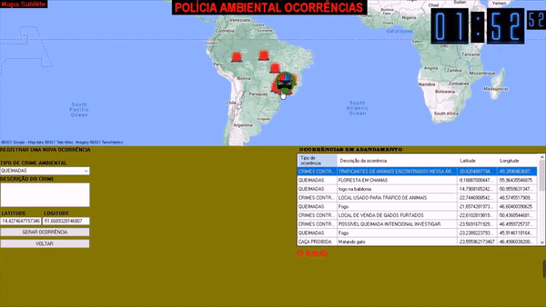

<strong>Autores: Jeferson Oliveira, Jefferson Pereira</strong>

<strong></strong>

<strong>Linkedin</strong>

<strong></strong>

<strong>YouTube</strong>

<strong>E-mail: <a href="mailto:contact.jeferson.oliveira@gmail.com">contact.jeferson.oliveira@gmail.com</a></strong>

&nbsp;

<h1>Network communication project in C#</h1>

This project was used as academic work at UNIP, it is an example of network communication via socket.

 

Software Usage Instructions
The client software open the client software the user will see the Login screen.

The login screen has two text fields a button and a label

Before logging in, the user must create an account by clicking on create account. After creating the account he can put the name he created and the password to log into the system.

The create accounts screen.

By clicking on create account in the login screen the user will open this screen where he can choose an image to use in his profile, he can also choose a name that does not have spaces or commas, and a password “It is important to repeat the same password on repeat password”, after that clicking on confirm your account will be created and saved in the database, you will be redirected to the login screen where you should login. To enter the home screen. By clicking Back the user will return to login.

The home screen.

The home screen will display the image that the player has chosen, it also has an online players field when clicking on an online play a menu will appear suggesting if the user wants to challenge that player in a tic-tac-toe battle the player who was challenged will receive a invitation where he can accept or decline the battle if he is in a battle the invitation will not appear for him, if he accepts they will be redirected to the Tic Tac Toe screen. The top 5 rank will display the top 5 players in the game. Chat can be used for anyone who is online to exchange messages.

The old woman's game screen.

When a battle invitation is accepted the user will be redirected to this screen where he can play the tic-tac-toe with the opponent. He will have access to the battle chat and the chat, the user must wait his turn to play in order to click on a button on the board. Your default color will be green and your opponent's color will be red. When the game ends in defeat, draw, or victory the button will appear to go back to the beginning and challenge again.

The occurrence screen.

In the occurrence screen the user can create an occurrence in the occurrence map, the map also displays the location of all users who are online with the environmental police vehicle icon.

To create an occurrence, the user must put the type of occurrence which is the type of crime and also the description there on the map. The user must point with the crosshair where this occurrence is to obtain the location, just point to the location and location will be obtained automatically.

With all the information entered, the user can now create an occurrence by clicking generate occurrence, the occurrence will be saved in the database with information on latitude, longitude, description and type of occurrence, after which the software will send this information via socket to the socket server which will send to all users online and will be displayed as a Windows notification.

The positions of online users will be updated every 3 seconds via socket, the client software will keep sending this information to the socket server in text type using the tcp layer, users will receive this information and according to the latitude and longitude received it will be A police vehicle icon indicating the location is drawn on the map.

The occurrences table in progress, this table has all the occurrence information and by clicking on an occurrence in the table the map will automatically display the occurrence location with the zoomed in like this:

